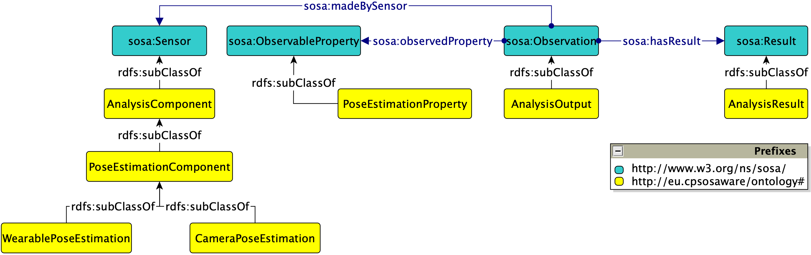

# CPSoSaware OntoCommons Demonstrator

Public repository hosting the source code for the CPSoSaware OntoCommons demonstrator


## Scope and Acknowledgement

This work takes place within the [CPSoSaware H2020 project](https://cpsosaware.eu/), in collaboration with [OntoCommons](https://ontocommons.eu/), and revolves around semantic data integration activities within the CPSoSaware Manufacturing Use Case. The pertinent activities lie within the scope of tasks T4.5 (led by partner ISI) and T6.4 (led by partner CRF) and focus on monitoring the human operators’ safety and well-being in an automotive manufacturing setting.

The scenario revolves around a collaborative application in an automotive assembly line. A human operator performs manual assembly operations on a windshield handled and moved by a robot before assembly on the chassis. Our overarching aim is to protect the operators from injuries and muscle strain and to reduce their body’s strain by performing biophysics assessment for ergonomic optimization. Towards this end, we deploy a semantic data integration framework for monitoring the human operators’ safety and well-being as they are performing the requested operations.


## Setup and Deployment

A set of IoT sensors submit their measurements to respective analysis components: (a) footage from static cameras analysed by computer vision components for estimating the operator’s anthropometrics parameters (i.e., posture); (b) wearables (inertial measurement units – IMUs, i.e., accelerometers and gyroscopes) for motion analysis and body tracking. The analysis outputs (and not the raw sensor measurements) are then fed to an ontology-based semantic Knowledge Graph (KG) through a custom ETL pipeline. Our overall aim is to perform a proactive ergonomics optimization of the equipment.


The deployment is currently being tested in a virtual environment and will soon be tested in a real factory setting at CRF premises. The simulation involves three static RGB cameras located in three different areas of the working environment monitoring the human's actions, while he collaborates with a robot to perform a specific task together. A pose estimation algorithm extracts in real time the posture landmarks and a confidence rate for each estimation. The outputs are fed into the ontology via semantic data integration, while a set of rules determine the camera with the best view. 

The same pipeline will be adopted in the real-life industrial environment in the coming months, with camera-based estimations from computer vision algorithms now coupled with body joints’ estimation based on the IMU sensors in online monitoring.


### Input Data

The pose estimation algorithm extracts posture landmarks and confidence rates roughly at a per second rate and generates JSON outputs. For reference, [this](input) folder contains a sample dataset. The `source` field takes one of three values, `backView`, `frontView`, `sideView`, while a set of 25 landmarks on the human operator’s body are detected, along with respective confidence rates and an overall average confidence rate for the whole set of landmarks per timestamp. The generated JSON outputs are fed to the semantic data integration pipeline, which populates the underlying semantic model accordingly, via suitable SPARQL update queries.


### Semantic Model

The diagram below displays in [Graffoo](https://essepuntato.it/graffoo/) notation the core semantic model, which extends the W3C-recommended [SOSA/SSN](https://www.w3.org/TR/vocab-ssn/).



Below is a description of the core concepts included in the semantic model:
- `AnalysisComponent` (and its specialisations) represents the components receiving the raw data measurements (e.g., camera feed and measurements from wearables), performing the respective analyses, and generating the results.
- `AnalysisOutput` represents the "observations", i.e., the outputs generated by the analysis components, accompanied by a respective timestamp.
- `AnalysisResult` represents the actual results from the analysis, i.e., values and units (if applicable).
- `PoseEstimationProperty` represents the observable property that is relevant to estimating the correctness or not of the human operator’s pose.


### Semantic Data Integration

Through the use of the ETL pipeline, the core semantic model is populated with instance data coming from the pose estimation algorithm. Below is a sample excerpt in TTL:

```turtle
:4af05ca5-af19-4fd8-9f14-e29266bcc43b rdf:type :AnalysisOutput ;
           sosa:resultTime "2021-09-02 02:11:18.999"^^xsd:dateTime ;
           sosa:madeBySensor :frontView ;
           sosa:hasSimpleResult "0.28568368707692304"^^xsd:double ;
           sosa:observedProperty :avg_cr .
```


## Sample SPARQL Queries

This subsection demonstrates some sample SPARQL queries for the given dataset.


### Retrieve the Average Confidence Rate (CR) per Source

```sparql
PREFIX : <http://cpsosaware.eu/ontology#>
PREFIX sosa: <http://www.w3.org/ns/sosa/>

SELECT ?source (AVG(?result) AS ?avgResult) WHERE {
    ?observation a :AnalysisOutput ;
                 sosa:observedProperty :avg_cr ;
                 sosa:hasSimpleResult ?result ;
                 sosa:madeBySensor ?source .
} GROUP BY ?source ORDER BY DESC(?avgResult)
```


### Evolution of Average CR per Source

```sparql
PREFIX : <http://cpsosaware.eu/ontology#>
PREFIX sosa: <http://www.w3.org/ns/sosa/>

SELECT ?timestamp ?avg_cr
WHERE {
    ?observation a :AnalysisOutput ;
                 sosa:observedProperty :avg_cr ;
                 sosa:hasSimpleResult ?avg_cr ;
                 sosa:resultTime ?timestamp ;
                 sosa:madeBySensor :frontView .
} ORDER BY ?timestamp
```


### Retrieve the Source with the Best CR per Timestamp

```sparql
PREFIX : <http://cpsosaware.eu/ontology#>
PREFIX sosa: <http://www.w3.org/ns/sosa/>

SELECT ?timestamp ?max_cr ?source 
WHERE {
    {
        SELECT ?timestamp (MAX(?avg_cr) AS ?max_cr) WHERE {
    		?observation a :AnalysisOutput ;
                 sosa:observedProperty :avg_cr ;
                 sosa:hasSimpleResult ?avg_cr ;
                 sosa:resultTime ?timestamp .
		} GROUP BY ?timestamp
    }
    ?observation a :AnalysisOutput ;
                 sosa:hasSimpleResult ?max_cr ;
                 sosa:madeBySensor ?source .
} ORDER BY ASC(?timestamp)
```


### Indicate low CRs based on User-defined Threshold

```sparql
PREFIX : <http://cpsosaware.eu/ontology#>
PREFIX sosa: <http://www.w3.org/ns/sosa/>

SELECT ?timestamp ?avg_cr ?source
WHERE {
    ?observation a :AnalysisOutput ;
                 sosa:observedProperty :avg_cr ;
                 sosa:hasSimpleResult ?avg_cr ;
                 sosa:resultTime ?timestamp ;
                 sosa:madeBySensor ?source .
    FILTER(?avg_cr < 0.3) .
} ORDER BY ?timestamp
```


### Retrieve Average Landmark Values for Upper Torso per Source

```sparql
PREFIX : <http://cpsosaware.eu/ontology#>
PREFIX sosa: <http://www.w3.org/ns/sosa/>

SELECT ?timestamp (AVG(?result) AS ?avgResult)
WHERE {
    ?observation a :AnalysisOutput ;
                 sosa:observedProperty ?property ;
                 sosa:resultTime ?timestamp ;
                 sosa:hasSimpleResult ?result ;
                 sosa:madeBySensor :sideView .
    VALUES ?property { :landmark_2 :landmark_3 :landmark_4 :landmark_5 :landmark_6 :landmark_7 :landmark_8 }
} GROUP BY ?timestamp ORDER BY ASC(?timestamp)
```


## Running the Code

Simply build the code with Maven and run the `Main` class with two arguments:
1. Absolute path to folder containing the input JSON files. 
2. Triplestore endpoint.